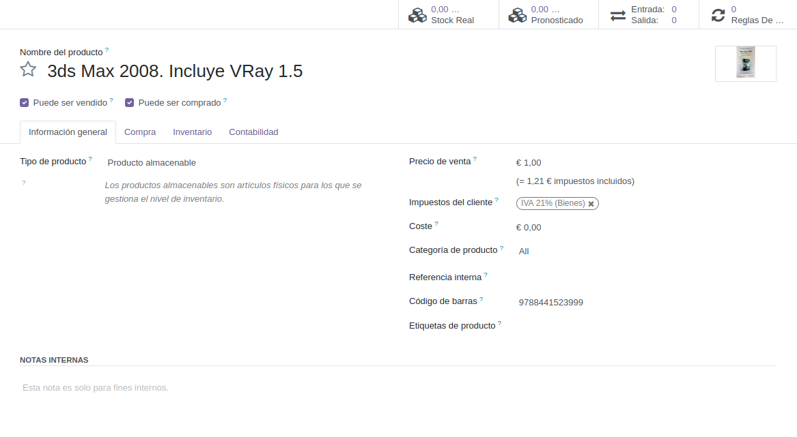
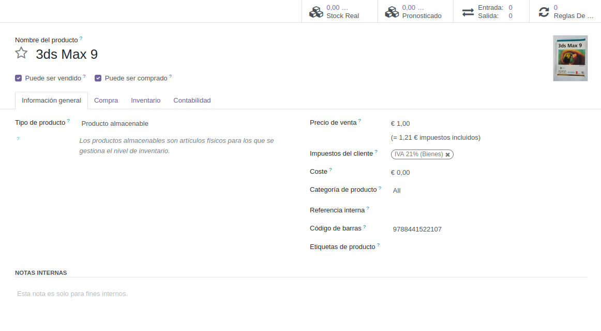
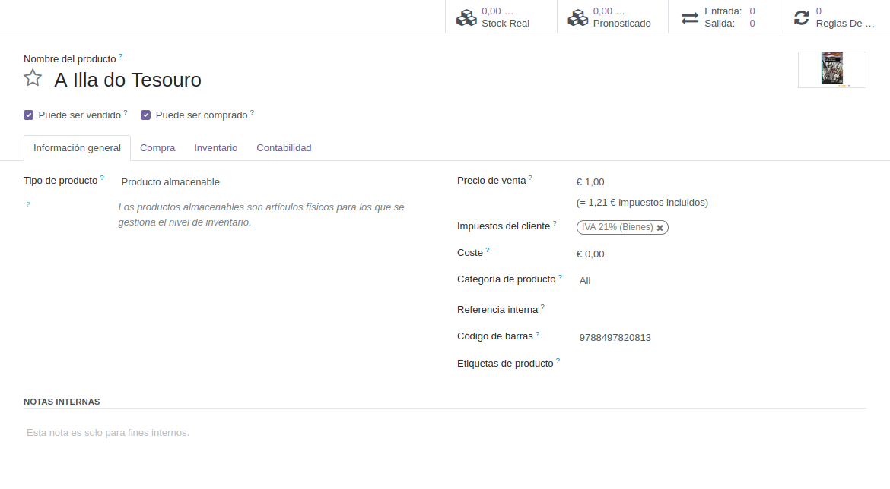
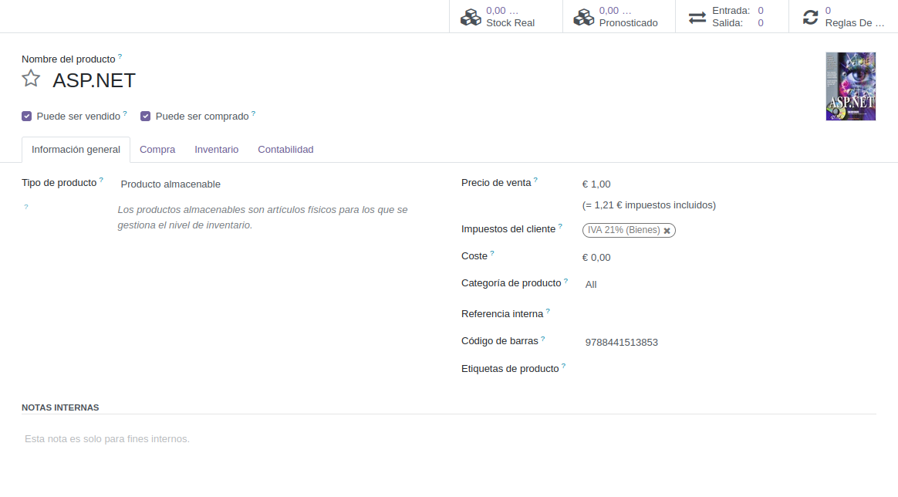
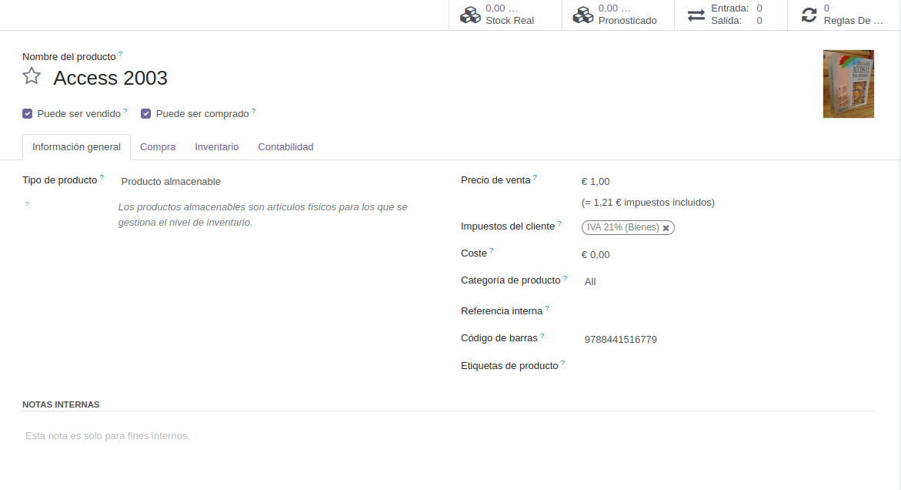

# Integración de servicios externos
Para integrar la búsqueda de imágenes de Google en Odoo hay que realizar los siguientes pasos:
1. En el menú de arriba a la izquierda con la cuadrícula 3x3, abrimos el menú y seleccionamos la opción `Aplicaciones`
2. Buscamos el módulo Inventario y pinchamos `Activar`
3. Esperamos un poco y nos llevará al módulo de comunicación. Pinchamos en el menú de arriba a la izquierda y vamos a `Inventario`
4. Una vez en `Inventario` en la barra superior pinchamos en `Productos`>`Productos` 
5. Ahora vamos a importar unos productos ya hechos desde un archivo `.xls` (también es posible hacerlo con `.csv`). Sin embargo, en este formato no es posible adjuntar imágenes, por eso vamos a activar la búsqueda de Google. El archivo que voy a utilizar es [libros.xls](./libros.xls).  
   Una vez descargado en la pantalla de productos de odoo pinchamos en `Favoritos`>`Importar registros`. En la siguiente pantalla que se abre podemos descargar la plantilla para poder importar los registros de productos necesarios. Como ya tenemos el archivo simplemente vamos a darle al botón `Subir archivo` y seleccionamos el archivo a importar. Una vez seleccionado, tenemos que hacer cuadrar los campos del excel con campos de Odoo.  
   Cuando hayamos hecho esto, pinchamos en `Importar` (Desmarcar la opción de imagen, ya que las vamos a cargar desde la API de Google).
6. Para activar el módulo de *Google Progamable Search* vamos a [console.cloud.google.com](https://console.cloud.google.com).  
   Iniciamos sesión con nuestra cuenta de Google y en el menú de arriba a la izquierda lo desplegamos y pinchamos en `APIs y servicios habilitados`. Pincha en un campo que pondrá `Crear proyecto`. Ponle un nombre al proyecto y pincha en `Crear`. Una vez creado el proyecto, busca en la barra de búsqueda `Custom Search Engine`, ábrelo y pincha en `Habilitar`.  
   Una vez habilitado este servicio pincha en `Credenciales` en el menú de la izquierda. En la barra superior pulsa en `Crear credenciales` > `Clave de API`. Se creará la clave de API. Cópiala y guárdala.  
7. Ahora hay que crear un motor de búsqueda programable. Para ello ve a [programmablesearchengine.google.com](https://programmablesearchengine.google.com). Inicia sesión con tu cuenta de Google y entra en el panel de control de la página. Pincha en `Añadir`. Se te abrirá un panel con las siguientes opciones:
	- `Asigna un nombre a tu buscador`: El nombre que tendrá el buscador
	- `¿Dónde buscar?`: Aquí puedes seleccionar dónde buscará el buscador personalizado. Puedes seleccionar `Buscar sitios o páginas específicos`, con la que podrás hacer lo que dice la propia opción, indicando los sitios en lo que se va a buscar o `Buscar en toda la web`. 
	- `Configuración de búsqueda`: Dos opciones a activar/desactivar: 
		- `Búsqueda por imágenes`: búsqueda de imágenes para el bucador
		- `Búsqueda segura`: Filtra resultados para excluir resultados con contenido explícito

   Ponle un nombre, selecciona `Buscar en toda la web` y activa la `Búsqueda por imágenes` y la `Búsqueda segura`. Pasa el CAPTCHA y pincha en `Crear`.
   Una vez creado vuelve al panel de control, pincha en el buscador que acabas de crear y copia el ID de buscador.
8. Volvemos a Odoo, abre el menú de la izquierda y pincha en `Ajustes`. De ahí ve a `Opciones generales`>`Integraciones`. Activa la opción `Google Imágenes` y dale a `Guardar`. Se recargará la página. Vuelve a `Opciones generales`>`Integraciones`. Habrán aparecido dos campos:
	- `Clave API`: Aquí pegarás la clave que creaste en [console.cloud.google.com](https://console.cloud.google.com)
	- `ID del motor de búsqueda`: Aquí pegará el ID del buscador que creaste en [programmablesearchengine.google.com](https://programmablesearchengine.google.com)

	Una vez hecho esto, pincha en `Guardar`
9. Volvemos al módulo de `Inventario` a la sección `Productos`. Cambia a la vista de lista. Selecciona los productos para los que quieras encontrar imagen. Pincha en `Acción`>`Obtener imágenes de Google Imágenes`.  
   Se abrirá un cuadro que nos dirá cuántos productos hemos seleccionado y nos recordará que las imágenes puede que tengan derechos de autor y que no deberíamos publicarlas en nuestro sitio web. Pincha en `Obtener imágenes` para que empiece a generar y ya estará listo.

