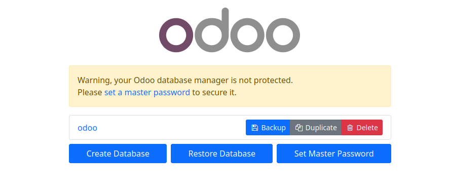
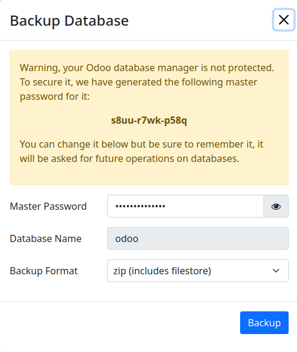
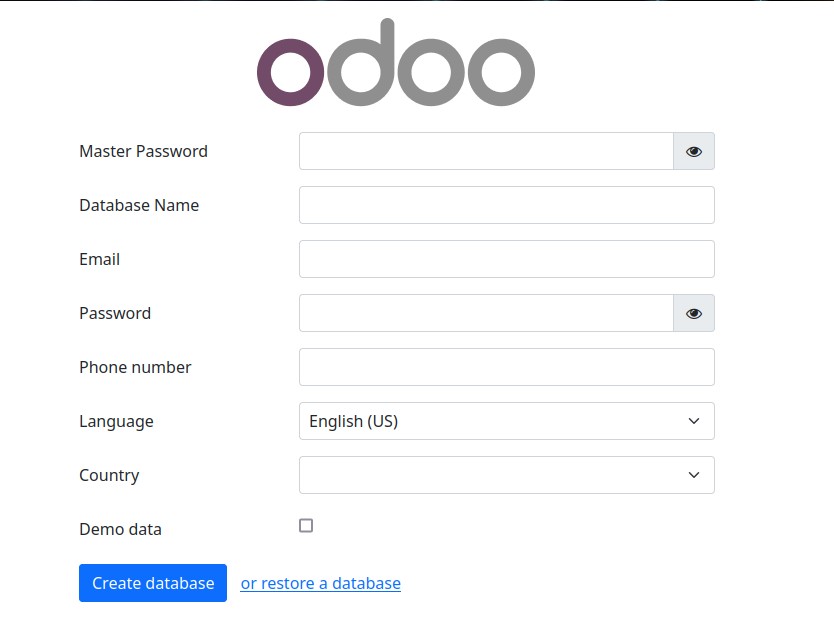
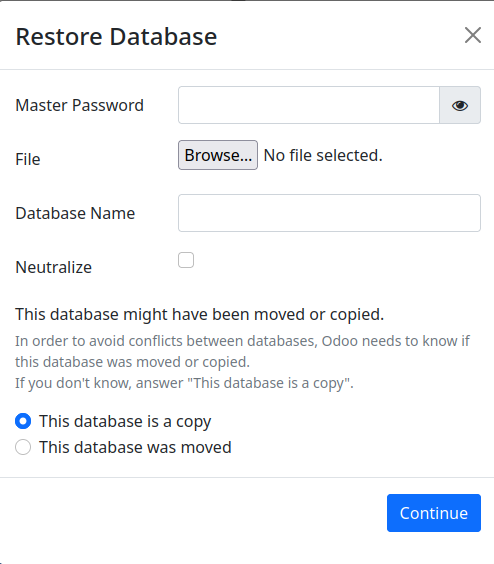
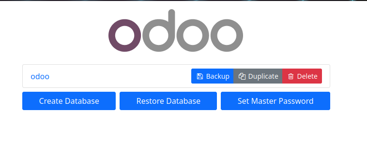

# Copias de seguridad
Distintas formas de hacer copias de seguridad en Odoo
# Ejercicio 1
1. Primero levantamos los contenedores con `docker compose`. Para ello:
		`docker compose up` (si no los hemos creado todavía)
		o
		`docker compose start` (si ya los hemos creado)
2. Una vez levantados tenemos que entrar en el contenedor de la base de datos para poder hacer la copia de seguridad:
		`docker compose exec [nombre del contenedor] bash`
3. Dentro del contenedor, para que el archivo de copia se borre una vez apagado el contenedor vamos a la carpeta `/tmp`.  
   Dentro de la carpeta tenemos que primero parar el servicio de postgres con:  
   `service postgresql stop`  
   Una vez parado ejecutamos el comando `pg_dump`:  
   `pg_dump -U usuario bd > backup.sql`  
   En mi caso:  
   `pg_dump -U odoo odoo > backup.sql`  
   Volvemos a iniciar el servicio:  
   `service postgresql start`  
   Para salir del contenedor:  
   `exit`  
4. Ahora para copiar el archivo a la máquina anfitriona vamos a utilizar el comando `docker cp`:  
   `docker cp idContenedor:rutaArchivoContenedor rutaAnfitrion`  
   En mi caso:   
   `docker cp 9d18b072c297:/tmp/backup.sql ./backup.sql`  
   Una vez ejecutado este comando se habrá copiado el archivo con el que podemos restaurar la base de datos en la máquina anfitriona  
5. Ahora eliminamos los contenedores del registro de docker con:  
   `docker compose down`  
   Para  comprobar que se han eliminado correctamente:  
   `docker ps`  
6. Ahora eliminaremos los datos contenidos en `dataPG`, `addons`, `filestore` y `sessions`. Cómo los directorios se han bloqueado, tendremos que cambiarnos al usuario `root` para poder borrar el contenido:  
   `sudo su`  
   Para entrar en el directorio:  
   `cd ./dataPG`  
   Y para eliminar el contenido:  
   `rm -rf *`  
   Repetir con los otros tres directorios.  
7. Ahora volvemos a crear los contenedores con:  
   `docker compose up`  
   Una vez creados comprobamos que no quedan datos para eliminar entrando con un navegador en `localhost:8069`:  
     
8. Ahora para restaurar la copia de seguridad, primero paramos el contenedor de odoo con:  
   `docker stop odoodev`  
   Antes de entrar otra vez a la consola del contenedor, hay que volver a copiar el archivo de la copia de seguridad de la base de datos de vuelta al contenedor con la orden `docker cp` pero esta vez con los argumentos cambiados:  
   `docker cp ./backup.sql a2a0071bfaa8:/tmp/backup.sql`  
   _NOTA: Al haber reiniciado el contenedor se cambiará el identificador del contenedor_  
   Una vez detenido y copiado el archivo, volvemos a entrar en el contenedor de la base de datos con:  
   `docker compose exec db bash`  
   Una vez dentro vamos a la ruta dónde hayamos copiado el archivo y ejecutamos:  
   `createdb -U odoo -O odoo odoo`  
   `psql -U odoo < ./backup.sql`  
   Se deberían restaurar todos los datos de vuelta, de anteriores prácticas.  
   
# Ejercicio 2
En este ejercicio haremos y restauraremos una copia de seguridad desde la interfaz gráfica:
1. Vamos a la URL `localhost:8069/web/database/manager`. Aparecerá una pantalla cómo esta:

2. Aquí puede haber más de una base de datos, la que nos importa a nosotros en este caso es la que se llama `odoo`. Pincha en `Backup` o el equivalente. Saldrá el siguiente recuadro:  

Pon la contraseña maestra que estableciste para la base de datos (cómo la reestablecimos directamente en Postgres, la contraseña no se ha generado, así que lo que pongas se convertirá en la contraseña maestra) y en backup format selecciona la opción zip y dale a `Backup`.
3. Ahora borra la base de datos pinchando en `Delete`. Te preguntará por la contraseña maestra, escríbela y dale a `Delete`. Volverás a la página de creación de la base de datos para Odoo:

4. Aquí en lugar de rellenar los datos pinchamos en `or restore a database`. Saldrá el siguiente recuadro:
  
	Tendrás que escribir lo siguiente:
   1.  Contraseña maestra: La contraseña que escribiste antes
   2. Archivo: El archivo que se descargó tras hacer la copia
   3. Nombre de la base de datos: en nuestro caso `odoo`
   4. Neutralizar: si quieres que la base de datos sea solo lectura
   5. La base de datos es una copia/se movió: opción para evitar confllictos en nuestro caso es una copia
   Pincha en `Continue`.
   Si todo ha salido bien debería haber salido lo siguiente:
   