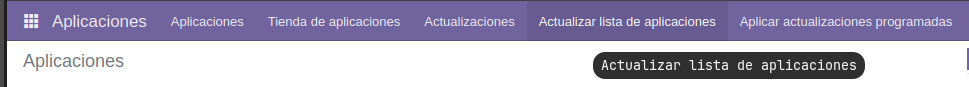

# Creación de un módulo básico
## Creación estructura proyecto
El primer paso para poder crear un módulo es tener la estructura del proyecto. Para ello `odoo` proporciona el comando `scaffold` para generar la estructura. Sin embargo, al solo estar instalado en el contenedor, hay que ejecutar el comando dentro de él:  
`docker compose exec <nombre_servicio> bash`  
En mi caso:  
`docker compose exec odoo bash`  
Una vez ejecutado este comando, estaremos dentro de la consola del terminal y así podremos ejecutar los comandos que sean necesarios dentro del contenedor. Para este caso el comando sería:  
`odoo scaffold <nombre_modulo> /mnt/extra-addons`  
En mi caso:
`odoo scaffold gestion_salas /mnt/extra-addons`  

> 	NOTA: A pesar de que en mi caso haya puesto el nombre del módulo en español, es recomendable ponerlo en inglés

Es importante que la ruta sea `/mnt/extra-addons` ya que esa es en la que `odoo` buscará los módulos. Además esa ruta debería estar mapeada a la máquina física para así poder desarrollar los módulos con facilidad.  
## Activación modo desarrollador 
Para poder empezar a desarrollar, primero hay que activar las opciones de desarrolador. Para ello hay que ir a la sección de `Ajustes` -> `Opciones generales` -> `Herramientas de desarrollador` -> `Activar modo de desarrollador`  
  
  
## Aparición del módulo en la lista de `Aplicaciones`
Una vez hecho esto, en la sección de `Aplicaciones` para actualizar las sección de aplicaciones y que sea posible cargar los módulos de `/mnt/extra-addons` (de ahí la importancia de la ruta en el [paso anterior](#Creación%20estructura%20proyecto)), hay que pulsar el botón de `Actualizar lista de aplicaciones`.

Una vez hecho esto y confirmada la actualización de la lista de aplicaciones se debería de haber cargado el módulo creado. Para buscarla, hay que escribir una palabra clave del módulo para encontrarlo.

Una vez ejecutada la búsqueda, debería aparecer el módulo:

Si se instala (en mi caso ya está instalado), aparecerá en el menú de aplicaciones:

## Desarrollo del módulo
### Modificación de manifiesto del módulo
Lo primero que hay que hacer es editar el archivo `manifest.py` para establecer algunos valores del módulo, cómo el nombre o que archivos se van a utilizar.
En el archivo `__manifest__.py`, se declara un diccionario de python con una serie de valores que odoo utilizará:
```python
# -*- coding: utf-8 -*-
{
    'name': "Gestión salas y reservas",

    'summary': """
        Este módulo se utiliza para la gestión de las reservas y las salas de una empresa
        """,

    'description': """
        Este módulo se utiliza para la gestión de las reservas y las salas de una empresa, para así llevarlas a cabo de manera más ordenada y eficiente
    """,

    'author': "My Company",
    'website': "https://www.yourcompany.com",
    'category': 'Uncategorized',
    'version': '0.1',

    'depends': ['base'],

    'data': [
        'security/ir.model.access.csv',
        'views/views.xml',
        'views/templates.xml',
    ],
    'demo': [
        'demo/demo.xml',
    ],
    'application': False
} #type: ignore
```
De estos valores algunos son:
- `name`: nombre del módulo
- `summary`: descripción resumida del módulo
- `description`: descripción más larga del módulo
- `author`: autor del módulo/aplicación
- `website`: sitio web del desarrollador
- `category`: categoría a la que pertenece el módulo
- `version`: la versión del módulo. Tiene que seguir las convenciones del [`Semantic versioning`](https://semver.org)
- `depends`: un `array` de `strings`. Son las dependencias del módulo. Todo módulo debe depender de por lo menos un solo módulo: el módulo `base`.
- `data`: los archivos de datos que se van a cargar de archivos `xml` o `csv`.
- `demo`: los archivos de datos que se van a cargar para las demostraciones.
- `application`: tiene que tener un valor `booleano`. Si es `True` es una aplicación. Si es `False` será un módulo
>	NOTA: Cómo ese diccionario no se utilizará en ningún sitio, es posible que el linter te de un warning. Si quieres que ignore este warning o algún error que tú sabes que no lo es, incluye un comentario al final de la linea que sea # type: ignore
### Declaración del modelo a utilizar
```python
# -*- coding: utf-8 -*-

from odoo import models, fields, api # type: ignore


class salas(models.Model):
    _name = 'gestion_salas.salas'
    _description = 'Modelo para las salas'

    nombre = fields.Text()
    capacidad = fields.Integer()
    fecha_reserva = fields.Datetime(string="Fecha de reserva")
    reservada = fields.Boolean("Reservada")
    comentarios = fields.Text()
```
### Archivos modificados respecto al proyecto generado por `odoo scaffold`
[`__manifest.py__`](./manifest.md)
[`models/models.py`](./models.md)
[`security/ir.model.access.csv`](./ir.model.access.md)
[`views/views.xml`](./views.md)