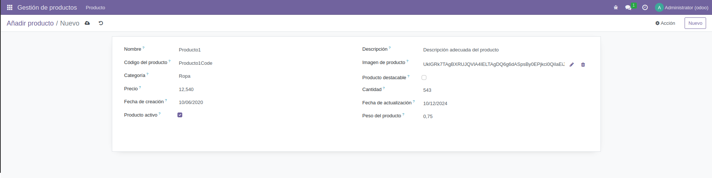

# PR0601 - Exploración de campos del modelo
## Resultado  

## Código utilizado
[`__manifest__.py`](./files/__manifest__.py.md)  
[`models/__init__.py`](./files/models-__init__.py.md)  
[`models/producto.py`](./files/models-producto.py.md)  
[`views/menu.xml`](./files/views-menu.xml.md)
[`views/producto.xml`](./files/views-producto.xml.md)