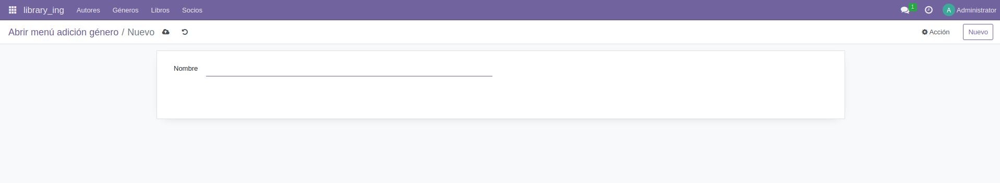

# PR0602 - Campos relacionales

## Prueba de funcionamiento

## Código utilizado
[`__manifest__.py`](./files/__manifest__.py.md)  
[`models/__init__.py`](./files/models/__init__.py.md)  
[`models/autores.py`](./files/models/autores.py.md)  
[`models/generos.py`](./files/models/generos.py.md)  
[`models/libros.py`](./files/models/libros.py.md)  
[`models/socios.py`](./files/models/socios.py.md)  
[`security/ir.model.access.csv`](./files/security/ir.model.access.csv.md)  
[`views/library_autores_views.xml`](./files/views/library_autores_views.xml.md)  
[`views/library_generos_views.xml`](./files/views/library_generos_views.xml.md)  
[`views/library_libros_views.xml`](./files/views/library_libros_views.xml.md)  
[`views/library_menu_views.xml`](./files/views/library_menu_views.xml.md)  
[`views/library_socios_views.xml`](./files/views/library_socios_views.xml.md)  