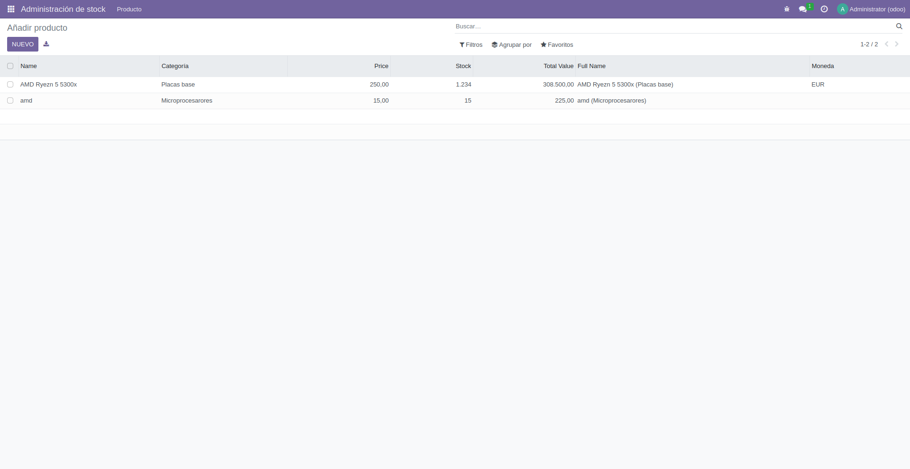
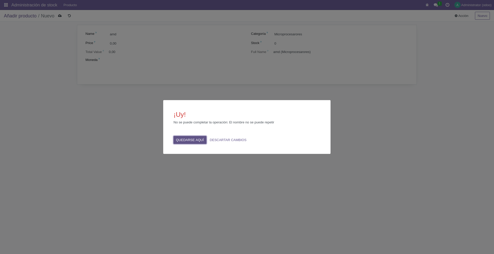
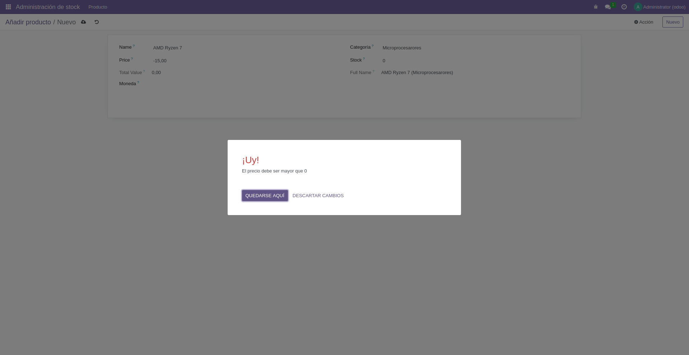

# PR0603: Campos calculados y restricciones
## Capturas con prueba de funcionamiento
### Productos ya añadidos

### Producto con un nombre de menos de tres caracteres

### Producto con un nombre repetido

### Producto con un precio negativo

### Producto con un stock negativo

## Archivos con código fuente 
[`__manifest__.py`](./files/__manifest__.py.md)
[`models/__init__.py`](./files/models/__init__.py.md)
[`models/product.py`](./files/models/product.py.md)
[`security/ir.model.access.csv`](./files/security/ir.model.access.csv.md)
[`views/menu.xml`](./files/views/menu.xml.md)
[`views/product.xml`](./files/views/product.xml.md)
