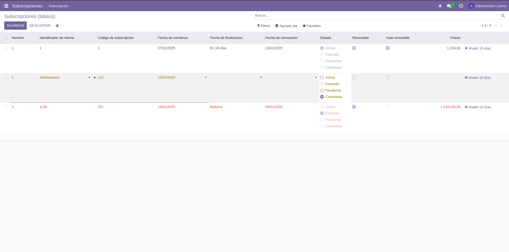
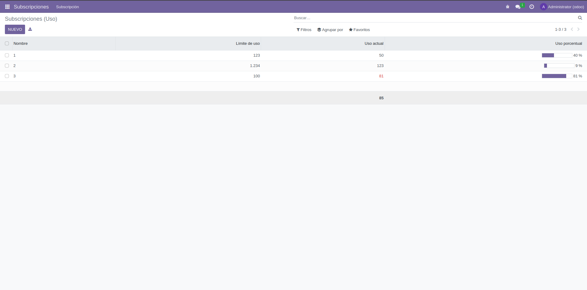

# PR0604
## Archivos con código fuente
[manifest.py](./files/manifest.py.md)  
[models/__init__.py](./files/models/__init__.py.md)  
[models/subscription.py](./files/models/subscription.py.md)  
[security/ir.model.access.csv](./files/security/ir.model.access.csv.md)  
[views/basic_subscription_view.xml](./files/views/basic_subscription_view.xml.md)
[views/menu.xml](./files/views/menu.xml.md)
[views/usage_subscription_view.xml](./files/views/usage_subscription_view.xml.md)
## Pruebas de funcionamiento

