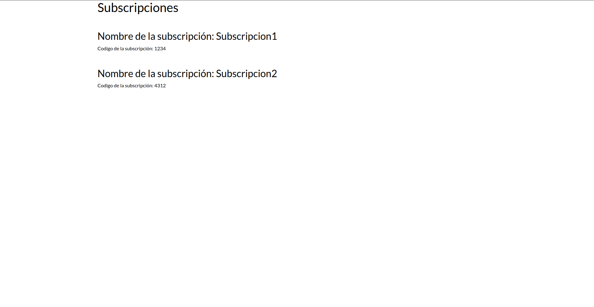

# PR0701
Esta práctica está basada en la [práctica 0605](../../ut06/pr0605/index.md), que a su vez depende de la [práctica 0604](../../ut06/pr0604/index.md), por lo que solo se incluirán los archivos que se han cambiado.
## Archivos con código fuente
[`__manifest__.py`](./files/__manifest__.py.md)
[`controllers/controllers.py`](./files/controllers/controllers.py.md)
[`views/welcome_message.xml`](./files/views/welcome_message.xml.md)
[`views/subscription_view.xml`](./files/views/subscription_view.xml.md)

## Pruebas de funcionamiento

  
