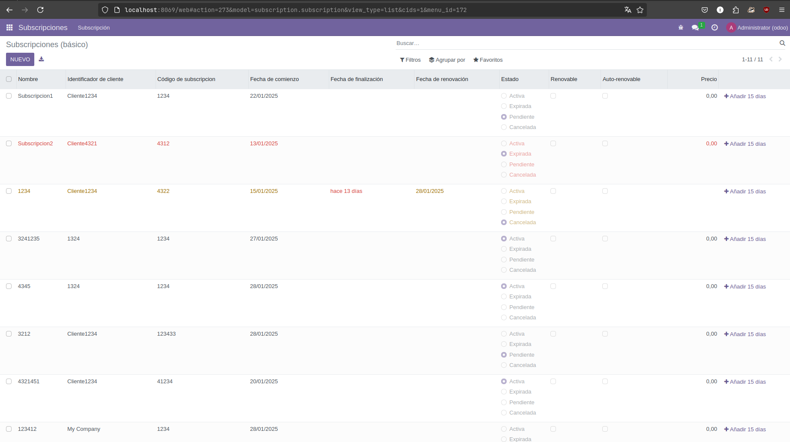
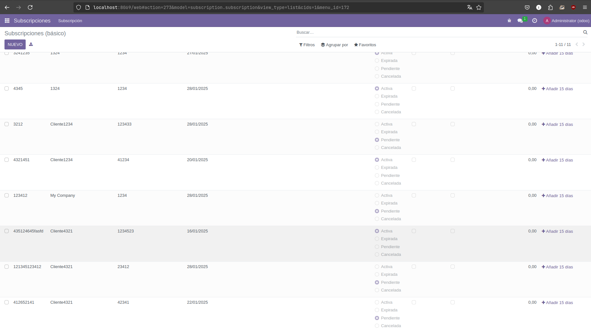
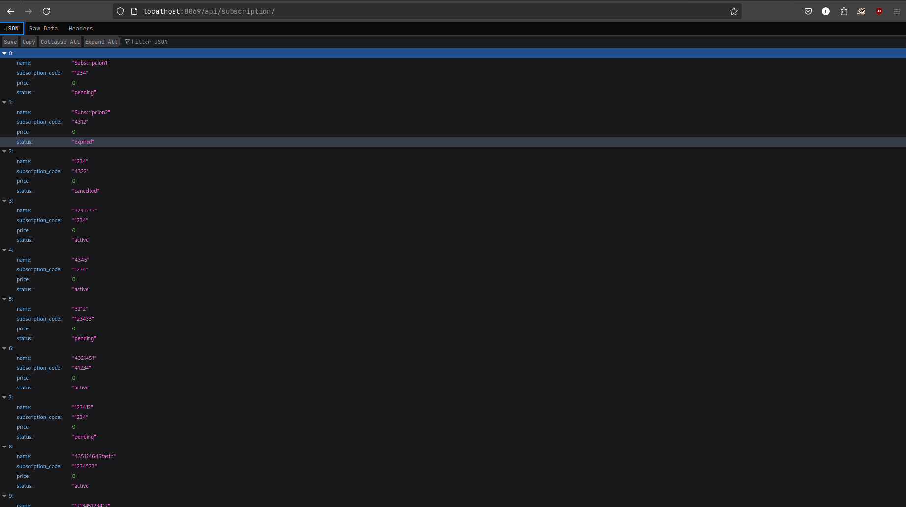
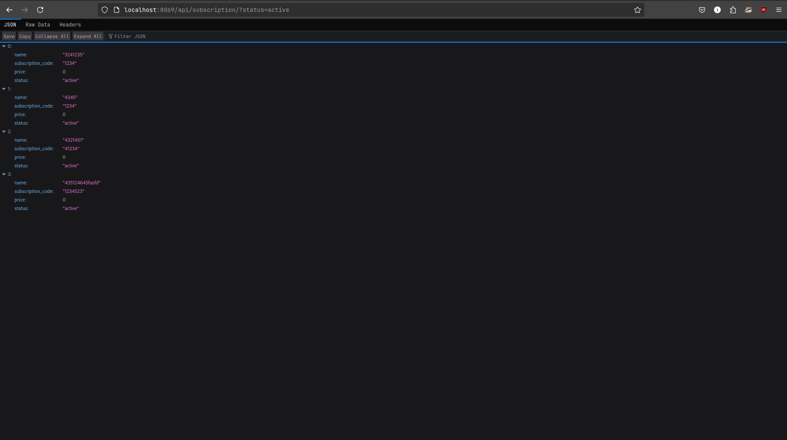
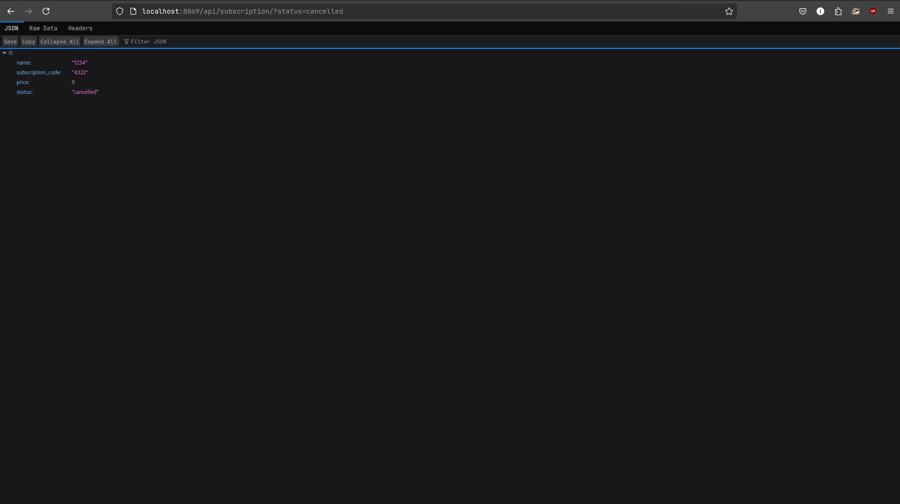
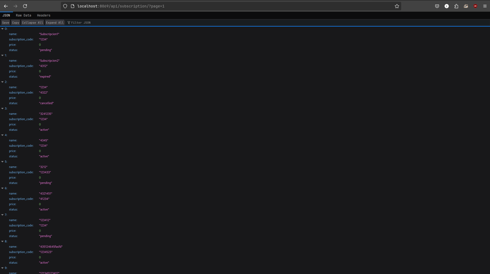
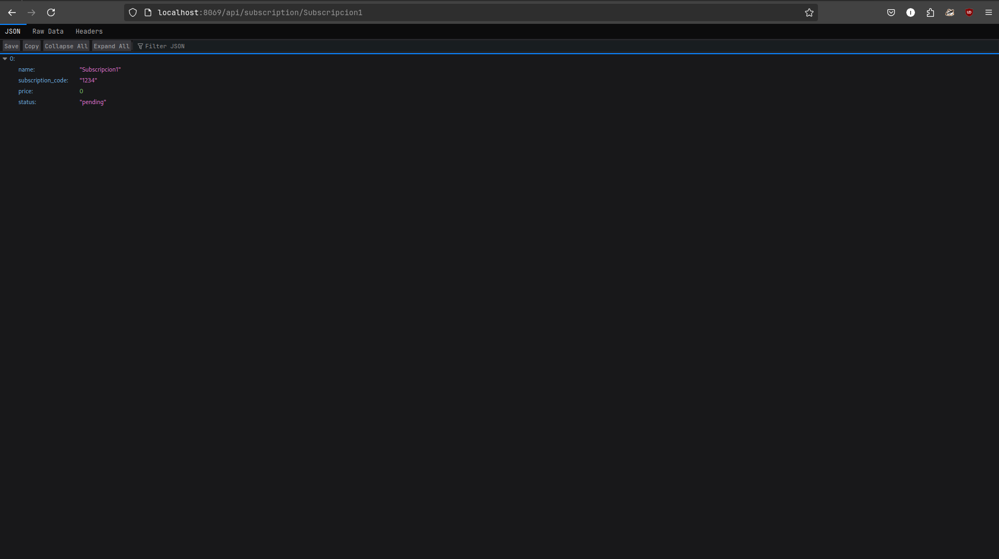
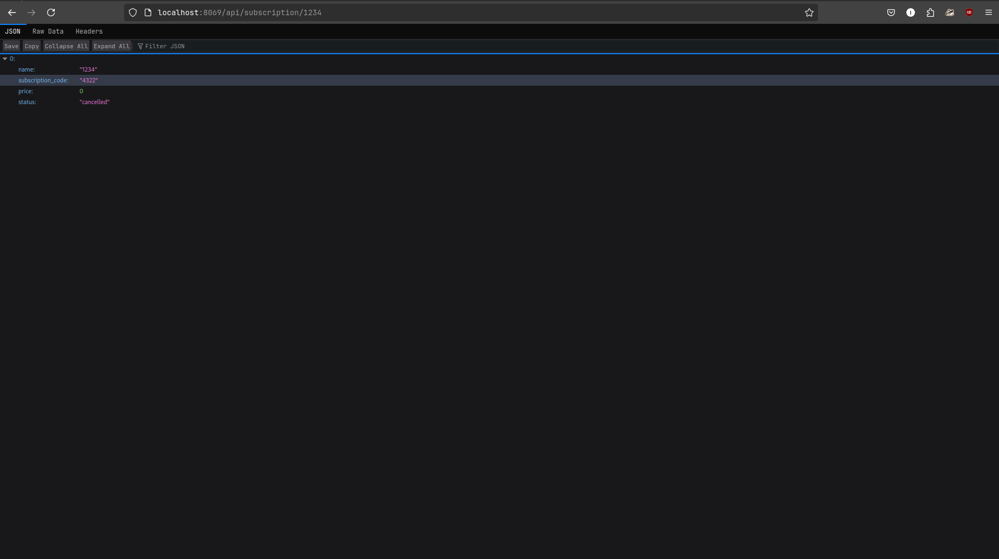

# PR0702
## Archivos con código fuente
[`controllers/controllers.py`](./files/controllers.py.md)
## Pruebas de funcionamiento
### Subscripciones


### `/api/subscription`

```json
[{"name": "Subscripcion1", "subscription_code": "1234", "price": 0.0, "status": "pending"}, {"name": "Subscripcion2", "subscription_code": "4312", "price": 0.0, "status": "expired"}, {"name": "1234", "subscription_code": "4322", "price": 0.0, "status": "cancelled"}, {"name": "3241235", "subscription_code": "1234", "price": 0.0, "status": "active"}, {"name": "4345", "subscription_code": "1234", "price": 0.0, "status": "active"}, {"name": "3212", "subscription_code": "123433", "price": 0.0, "status": "pending"}, {"name": "4321451", "subscription_code": "41234", "price": 0.0, "status": "active"}, {"name": "123412", "subscription_code": "1234", "price": 0.0, "status": "pending"}, {"name": "435124645fasfd", "subscription_code": "1234523", "price": 0.0, "status": "active"}, {"name": "121345123412", "subscription_code": "23412", "price": 0.0, "status": "pending"}, {"name": "412652141", "subscription_code": "42341", "price": 0.0, "status": "pending"}]
```
### `/api/subscription?status=active`

```json
[{"name": "3241235", "subscription_code": "1234", "price": 0.0, "status": "active"}, {"name": "4345", "subscription_code": "1234", "price": 0.0, "status": "active"}, {"name": "4321451", "subscription_code": "41234", "price": 0.0, "status": "active"}, {"name": "435124645fasfd", "subscription_code": "1234523", "price": 0.0, "status": "active"}]
```
### `/api/subscription?status=cancelled`

```json
[{"name": "1234", "subscription_code": "4322", "price": 0.0, "status": "cancelled"}]
```
### `/api/subscription?page=1`

```json
[{"name": "Subscripcion1", "subscription_code": "1234", "price": 0.0, "status": "pending"}, {"name": "Subscripcion2", "subscription_code": "4312", "price": 0.0, "status": "expired"}, {"name": "1234", "subscription_code": "4322", "price": 0.0, "status": "cancelled"}, {"name": "3241235", "subscription_code": "1234", "price": 0.0, "status": "active"}, {"name": "4345", "subscription_code": "1234", "price": 0.0, "status": "active"}, {"name": "3212", "subscription_code": "123433", "price": 0.0, "status": "pending"}, {"name": "4321451", "subscription_code": "41234", "price": 0.0, "status": "active"}, {"name": "123412", "subscription_code": "1234", "price": 0.0, "status": "pending"}, {"name": "435124645fasfd", "subscription_code": "1234523", "price": 0.0, "status": "active"}, {"name": "121345123412", "subscription_code": "23412", "price": 0.0, "status": "pending"}]
```
### `/api/subscription?page=2`

```json
[{"name": "412652141", "subscription_code": "42341", "price": 0.0, "status": "pending"}]
```
### `/api/subscription/Subscripcion1`

```json
[{"name": "Subscripcion1", "subscription_code": "1234", "price": 0.0, "status": "pending"}]
```
### `/api/subscription/1234`

```json
[{"name": "1234", "subscription_code": "4322", "price": 0.0, "status": "cancelled"}]
```